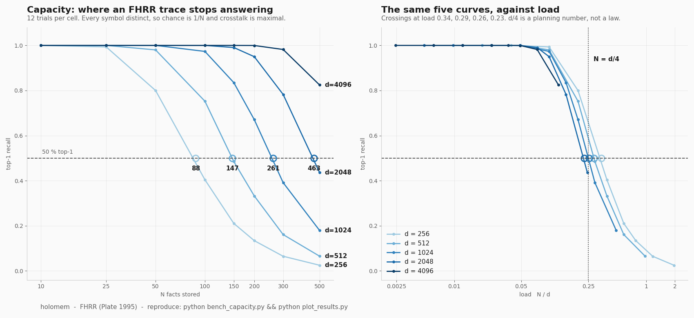
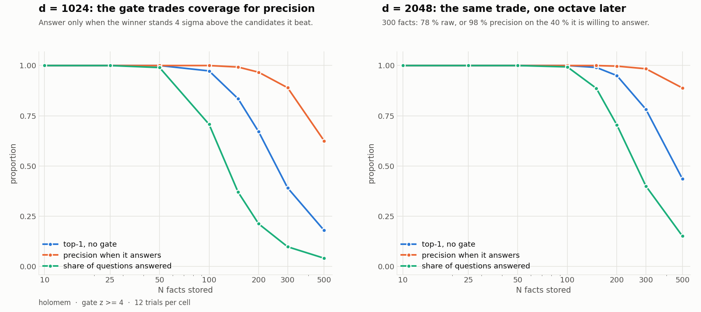
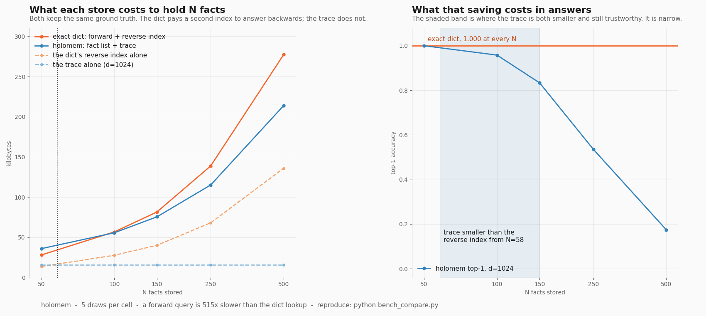

# A 1024-dimensional vector that remembers 150 facts, and knows when it doesn't

One complex vector holds every fact you ever taught it. Its size never changes.
You query it by algebra, not by search, and it answers backwards as easily as
forwards. It also ages: facts nobody reconfirms fade, contradicted facts are
subtracted exactly, and a second trace lets you ask what was true last spring.

This is a Fourier Holographic Reduced Representation, the frequency-domain
member of the Vector Symbolic Architecture family that Tony Plate described in
1995. That part is textbook and this repository does not claim it. What it adds
is the part the textbooks leave out: **a working temporal layer, and a measured
capacity curve you can reproduce in about half a minute.**

```
pip install numpy
python bench_capacity.py
```

Every cell is seeded from its own `d` and `N`, so that command rewrites
`results/capacity.json` with byte-identical content on a clean checkout. The
table in section 3 and both figures are views of that one file. Timed here at
34.2 s, band 34.0-35.5 over three passes.

I built this as the memory layer of [Dermioz](https://dermiozai.com), an AI
assistant I am working on. It earns its keep there, and the honest limits are
in section 6.

---

## 1. The algebra, in four lines

Every symbol is a unit phasor in `C^d`: `d` complex numbers of modulus 1, with
phases derived from a hash of the symbol's name.

```
bind(a, b)   = a * b                 elementwise. Phases ADD.
unbind(c, b) = c * conj(b)           phases SUBTRACT. Exact inverse of bind.
T            = sum_i  w_i * bind(S_i, R_i, O_i)      one vector, always
unbind(T, bind(S, R))  ~=  O + noise                 the query
```

The last line is the whole trick. Binding is *exactly* invertible for unit
phasors, so `unbind(bind(a,b), b) == a` to floating point. Superposition is
linear. When you unbind the whole sum by one key, the term that carried that
key comes back clean, and every other term comes back phase-scrambled and
nearly orthogonal to anything you care about.

So the answer is signal and the rest of the memory is noise. The noise grows
like `sqrt(N)`. **That ratio is the entire capacity story**, and section 3
measures it rather than asserting it.

One design choice makes the whole thing portable: symbols are *derived* from
the name, never assigned. There is no codebook to persist, insertion order does
not matter, and a plain list of facts rebuilds the identical vector on another
machine a year later.

---

## 2. Sixty seconds

```python
from datetime import datetime, timezone
from holomem import HolographicMemory

# The clock is injected, so this snippet prints the same thing on any day you
# run it. Pass a real clock in production; pin it whenever you want the output
# to be quotable.
NOW = datetime(2026, 9, 4, tzinfo=timezone.utc).timestamp()
MAY = datetime(2026, 5, 15, tzinfo=timezone.utc).timestamp()

m = HolographicMemory(dim=1024, now_fn=lambda: NOW)
m.learn("ana",   "works_on", "compiler")
m.learn("ana",   "lives_in", "lisbon", created_ts=MAY)  # true back in May
m.learn("bruno", "works_on", "scheduler")

m.query("ana", "works_on")                 # what does ana work on?
m.query_subject("works_on", "scheduler")   # who works on the scheduler?

m.contradict("ana", "lives_in", o="porto") # she moved
m.learn("ana", "lives_in", "porto")
m.query("ana", "lives_in")                 # porto
m.query_at("epoch:2026-05", "ana", "lives_in")   # but back in May: lisbon
```

Actual output, and `test_readme_example` in the test suite asserts it stays
that way:

```
trace (1024,) complex128, 3 facts, noise floor 0.0221
query(ana, works_on)                    'compiler'   score 0.580  margin 0.583
query_subject(works_on, scheduler)      'bruno'      score 0.565
query(ana, lives_in)      after move    'porto'      score 0.587  margin 0.433
query_at(epoch:2026-05, ana, lives_in)  'lisbon'     score 0.190  margin 0.175
```

**`created_ts` is load-bearing on the second line, and this README got it wrong
until now.** A fact learned without it is dated today, so the epochal query has
no May to find: the previous version of this snippet omitted it, printed
`'compiler'` at score 0.015 against a noise floor of 0.0221, and still claimed
`'lisbon'` in the block underneath. The dated question is the headline feature
of section 5, so it was the worst line in the file to be wrong. It is a test
now.

Note the third line. `query_subject` is not a second index, it is the same
trace unbound by the other pair. Walking a relation backwards costs nothing and
stores nothing, which is the property no vector database gives you.

Note also the noise floor, `0.0221`. Two unrelated symbols in `d=1024` score
about that against each other. Every number above should be read against it,
and `m.noise_floor()` prints it for you, because a score of 0.05 is meaningless
at `d=256` and meaningful at `d=8192`.

---

## 3. What it costs: the capacity curve

`bench_capacity.py` stores `N` triples whose symbols are all distinct, then
queries every one of them. This is the hard case on purpose: `N` facts means
`N` candidate objects, so chance is `1/N` and crosstalk is maximal. A real
memory, where one subject carries many relations, does better than this. **The
curve is a floor.**

12 trials per cell, means shown. `top-1` is the raw answer; `gated` and `cover`
are explained in section 4.

| d | N | top-1 | worst trial | gated precision | coverage |
|---:|---:|---:|---:|---:|---:|
| 256 | 50 | 0.800 | 0.640 | 0.994 | 26 % |
| 256 | 100 | 0.404 | 0.350 | 0.928 | 5 % |
| 512 | 50 | 0.980 | 0.940 | 1.000 | 74 % |
| 512 | 150 | 0.485 | 0.427 | 0.952 | 10 % |
| **1024** | **100** | **0.973** | 0.950 | **1.000** | **71 %** |
| **1024** | **150** | **0.835** | 0.813 | **0.993** | **37 %** |
| 1024 | 300 | 0.391 | 0.340 | 0.890 | 10 % |
| 2048 | 300 | 0.782 | 0.753 | 0.984 | 40 % |
| 4096 | 500 | 0.825 | 0.806 | 0.984 | 53 % |



The full sweep, all 40 cells, is `results/capacity.json`, and the figure is
drawn from that file by `plot_results.py`, which computes nothing: every point
on it is read from the JSON. The right panel is the same five curves against
load `N/d`: they nearly collapse onto one another, which is what makes a single
rule of thumb possible at all, and the residual spread is what makes it a rule
of thumb rather than a law.

**The rule of thumb, interpolated from the measurements: top-1 recall crosses
50 % at about `N = d/4`.** Measured crossings: `d=256` at N=88, `d=512` at
N=147, `d=1024` at N=261, `d=2048` at N=463. The ratio `d/N50` drifts from 2.9
to 4.4 across that range, so `d/4` is a planning number, not a law. `d=4096`
never crossed 50 % within the sweep's ceiling of 500 facts.

**Do not read that as a sizing rule.** `N = d/4` is where the memory *breaks*,
so choosing `d = 4N` sizes it exactly for failure. Measured directly in
`bench_compare.py`, 5 draws per cell: at `d = 4N` top-1 comes out 0.72 at
N=50, 0.63 at N=100, 0.56 at N=150, 0.52 at N=250 and 0.44 at N=500. Every
one of those is a coin flip dressed as a memory. If you want answers
rather than a coin flip, you want `d` several times larger than `4N`, and the
table above is where to read off how much larger.

For a personal memory holding a few hundred facts, `d=2048` is 32 KB of
complex128 per trace, 64 KB with the epochal one, and answers with 98 %
precision on 40 % of questions. That is the operating point I would start from.

---

## 4. Knowing when it doesn't know

Raw top-1 accuracy is the wrong headline. A memory that is right 60 % of the
time is not usable. A memory that is right 98 % of the time on the 40 % of
questions it is *willing* to answer, and silent on the rest, is usable.

What buys that is the **margin**: how far the winning candidate stands above
the rest. When the trace is overloaded the query still returns a winner, but
the winner stops standing out, and that collapse is measurable before you act
on the answer.

**I got the gate wrong the first time, and the failure is worth copying.** The
first version thresholded on an absolute margin of 0.10. It looked sensible at
N=25. At N=100 it passed **0.3 %** of queries, because every score shrinks as
the trace fills. An absolute confidence threshold silently stops firing exactly
when the memory starts needing one.

The fix is to measure confidence in units of the noise it competes with: a
z-score of the winner against the distribution of the candidates it beat.

```python
z = (top - others.mean()) / others.std()
answer if z >= 4 else stay silent
```

That number is scale-free, so one threshold holds across every dimension and
every N in the table above. All the `gated` and `cover` columns use `z >= 4`.



The blue line is what the memory says; the orange line is what it is right
about when it agrees to speak; the green line is how often it agrees. Past
the knee, the blue line is the one that lies to you.

---

## 5. The temporal layer

Classical VSA is timeless: facts go in and stay at full strength forever. A
memory about a person cannot work that way, because people change and beliefs
go stale. Four mechanisms, each a policy choice rather than a constant of
nature:

| mechanism | default | what it buys |
|---|---|---|
| **decay** | 45-day half-life | an unconfirmed belief fades instead of being asserted forever. Decay runs from *last confirmation*, not creation: age is not the same thing as irrelevance |
| **reinforcement** | +0.25 per mention, capped at 1.5 | repetition sharpens. The cap matters: without it one chatty week makes a fact permanently louder than everything since |
| **contradiction** | weight × 0.35 | superposition is linear, so damping the old belief is *exact*. No secondary index to invalidate, though the trace itself is recomputed. And it is damping, not deletion, which is what lets a system say "you used to say X" instead of quietly rewriting history |
| **epochal trace** | a second vector | every fact is also bound to the month it was learned, so dated questions are answerable without adding date crosstalk to the main trace |

There is also a floor: below an effective weight of 0.18 a fact stops entering
the trace. Without it, thousands of nearly dead facts contribute their full
share of crosstalk and no signal. You would be paying the noise of a memory you
no longer have.

---

## 6. What this is not

Read this section before building on it.

- **It is not a text index.** It stores triples, not prose. It complements a
  retriever, it does not replace one.
- **Capacity is bounded and the collapse is steep.** Past `N ≈ d/4` you are
  reading noise. Section 3 is the map.
- **Cleanup needs a candidate list.** The raw query output is approximate; you
  must snap it to a known symbol, which means holding the symbols.
- **Ground truth lives outside, so "fixed size" describes the trace, not the
  system.** Keep the plain fact list: the trace is a computed view of it,
  rebuilt rather than repaired, because every weight depends on the current
  time. Total memory is therefore O(N), and only the trace is constant.
- **It does not scale, and the numbers are worse than the algebra suggests.**
  `learn()` scans the fact list for duplicates, so inserting N facts is
  quadratic. `_build()` recomputes every weight. Neither is amortised.

  `python bench_cost.py` produces this table. Median of 3 passes, min-max in
  brackets, `d=1024`, CPython 3.11.9 on Windows, one idle laptop:

  | N | insert total | rebuild | query | fact list | trace |
  |---:|---:|---:|---:|---:|---:|
  | 250 | 0.09 s [0.09-0.09] | 4 ms [4-4] | 2.6 ms | 90 KB | 16 KB |
  | 500 | 0.38 s [0.38-0.39] | 9 ms [8-9] | 5.4 ms | 179 KB | 16 KB |
  | 1000 | 1.61 s [1.60-1.68] | 18 ms [17-18] | 11.0 ms | 358 KB | 16 KB |
  | 2000 | 7.24 s [6.96-7.28] | 317 ms [317-318] | 31.3 ms | 720 KB | 16 KB |
  | 4000 | 29.75 s [29.56-29.92] | 648 ms [638-650] | 69.8 ms | 1442 KB | 16 KB |

  **Read the exponent, not the ratio.** Step by step the insert cost grows with
  exponent 2.05, 2.08, 2.17, 2.04; overall 2.08 across the range. That is the
  number worth quoting, because it is scale-free: a machine twice as fast
  leaves it untouched, where a speed ratio between two N is a fact about one
  laptop on one afternoon.

  This matters here more than it would elsewhere. An earlier version of this
  table said 16x the facts cost **194x** the insert time. That figure came from
  a script that was never committed, and it does not reproduce: the shipped
  script measures 322x on an idle machine, exponent 2.08. And 194x is exponent
  1.90 — *below* 2.0 for a loop that is structurally quadratic, which is the
  signature of an inflated small-N denominator, the same defect that had
  already produced a 619x before it. Both are now superseded by the table
  above, and the exponent exists so the next machine does not restart the
  argument.

  **A cliff worth knowing about:** rebuild jumps 17x between N=1000 and N=2000,
  far more than the 2x the fact count would justify. `symbol()` caches derived
  vectors and clears the *whole* cache on overflow at 4096 entries. A store of
  N facts holds 3N distinct symbols, so past **N ≈ 1365** every rebuild
  regenerates every symbol from scratch. Measured against an unbounded cache:
  identical at N=1000 (0.9x), **9.1x slower at N=2000, 9.0x at N=4000**. It is
  documented rather than fixed, because changing the cache policy is a
  performance change to a library whose every published number was measured
  against this exact code, and because section 3 forbids that regime anyway.

  Which is the saving grace: at `d=1024` top-1 crosses 50 % at N=261, so one
  trace should never hold 4000 facts, or 1365. At N=250 a query is 2.6 ms and
  the whole store builds in under a tenth of a second. The capacity ceiling
  binds well before the performance ceiling does, which is luck rather than
  design.
  *(Both limits were pointed out by u/carefactor3zero on r/LLMDevs, 2026-09-03.)*
- **You cannot hand the vector to a language model.** This is the one that
  matters, because the pitch in this space keeps promising it. Every hosted
  model API in production consumes tokens, not vectors. There is no "ghost
  vector" of the user's history you can feed to a model behind a token API.
  What this memory actually does is decide *which few facts are still sharp
  enough to be worth spending tokens on*. That is a real job, and a smaller one
  than the vector-native version implies. Anyone selling you the other thing on
  top of a token API has not tried it.

---

## 7. Against a plain dict, which is the comparison that matters

On r/LLMDevs, u/carefactor3zero put the objection in one line: this is an
approximate associative key/value structure, and a B-tree is an exact indexed
one, roughly similar in form. That deserved a measurement rather than a reply,
so `bench_compare.py` is the measurement, and the baseline gets every
advantage. A plain Python dict is kinder to the baseline than a B-tree would
be: no ordering, no log factor, exact by construction, accuracy 1.000 at every
N and in every draw.

**Comparing total memory is the wrong comparison, in both directions.** Both
stores keep the same ground truth and neither can throw it away: holomem keeps
its fact list, the dict keeps its forward mapping. Comparing those measures
Python, not FHRR. The question with an answer is narrower, and it is the one
the thread was actually about: *what does it cost to answer backwards?* The
dict needs a second mapping, which grows with N. The trace answers backwards by
unbinding the same vector with the arguments swapped, which costs nothing extra
at any N. What it costs instead is exactness.

`d=1024`, 5 draws per cell:

| N | holomem top-1 | dict | trace | dict's reverse index | total, dict | total, holomem |
|---:|---:|---:|---:|---:|---:|---:|
| 50 | 1.000 | 1.000 | 16 KB | 14 KB | 28 KB | 36 KB |
| 100 | 0.958 | 1.000 | 16 KB | 28 KB | 57 KB | 56 KB |
| 150 | 0.833 | 1.000 | 16 KB | 40 KB | 82 KB | 76 KB |
| 250 | 0.535 | 1.000 | 16 KB | 68 KB | 139 KB | 115 KB |
| 500 | 0.174 | 1.000 | 16 KB | 136 KB | 277 KB | 214 KB |



**The honest verdict, which is narrower than "fixed size" sounds.** The dict's
reverse index passes the whole 16 KB trace at about **N=58**, so below that the
dict is smaller *and* exact and there is nothing to discuss. Above it the trace
is the smaller index, but the total only tips at N≈100, and the saving never
exceeds about **23 %** inside this range, reached at N=500 where top-1 has
already fallen to 0.174 and the memory is useless. In the band where the trace
is both smaller and still trustworthy, roughly **58 < N < 150 at d=1024**, the
whole-system saving is single-digit percent.

And it is paid for. A forward query is **515x slower** than the dict lookup,
median over these rows, and approximate where the dict is exact.

So the memory argument for a trace is real but small, and anyone selling it as
the headline is overselling. What survives the comparison is not bytes:

- backward queries need no second structure to build, populate, or keep
  consistent with the first;
- the answer arrives with a calibrated confidence, so the store can decline to
  answer (section 4) where a dict miss tells you only that a key was absent;
- beliefs decay, reinforce and get contradicted by weight (section 5), which a
  dict has no place to put.

Use a dict until one of those three is the thing you actually need.

---

## 8. Tests, and the one that was decorative

```
pytest -q        # 20 tests, under two seconds
```

The suite is written so that breaking a guarded line fails it. That claim is
cheap to make and I checked it by mutation: flip a line in the library, confirm
the suite goes red, restore. Seven mutants plus a neutral witness.

Six bit. One did not, and it is the instructive one:

```python
# before, and green even when contradiction was disabled entirely
assert old.weight == pytest.approx(m.CONTRADICT_FACTOR)
```

That asserts `x == x`. Setting `CONTRADICT_FACTOR = 1.0`, which turns
contradiction into a no-op, moved both sides of the comparison together and the
suite stayed green. It now pins the behaviour, a strict decrease, and a second
test asserts the margin *widens* after a contradiction, which is the effect
anyone would actually notice. Both go red under that mutant now.

I found it by mutating, not by reading. Reading had already passed it twice.

### Reproducing every number in this README

Four commands, no arguments, nothing hidden. Each writes its own JSON under
`results/`, and the figures are drawn from those files rather than from
anything held in a notebook:

```
python bench_capacity.py     # section 3   ~35 s   -> results/capacity.json
python bench_cost.py         # section 6   ~4 min  -> results/cost.json
python bench_compare.py      # section 7   ~2 min  -> results/compare.json
python plot_results.py       # the three figures, drawn from the three files
```

Two habits are worth copying more than any number above. **Check that nothing
else is running before you time anything**: every wrong figure this repository
has published came from a machine that was busier than I thought. And **quote
an exponent, or a z-score, or anything else that cancels the scale**, in
preference to a ratio: the ratio is a fact about the laptop, and it is the
thing that has to be retracted later.

---

## 9. Prior art

- Plate, *Holographic Reduced Representations*, 1995. The original.
- Kleyko et al., *A Survey on Hyperdimensional Computing aka Vector Symbolic
  Architectures*, ACM Computing Surveys.
- Alam et al., *Generalized Holographic Reduced Representations*, 2024.

The classical algebra is theirs. The temporal layer, the z-gate and the
capacity numbers in this repository are mine, and the code is short enough to
check.

This came out of [Dermioz](https://dermiozai.com). If you want to know what
else is in there, that is where to look.

## License

MIT. Copyright (c) 2026 Dermioz AI, SASU.
